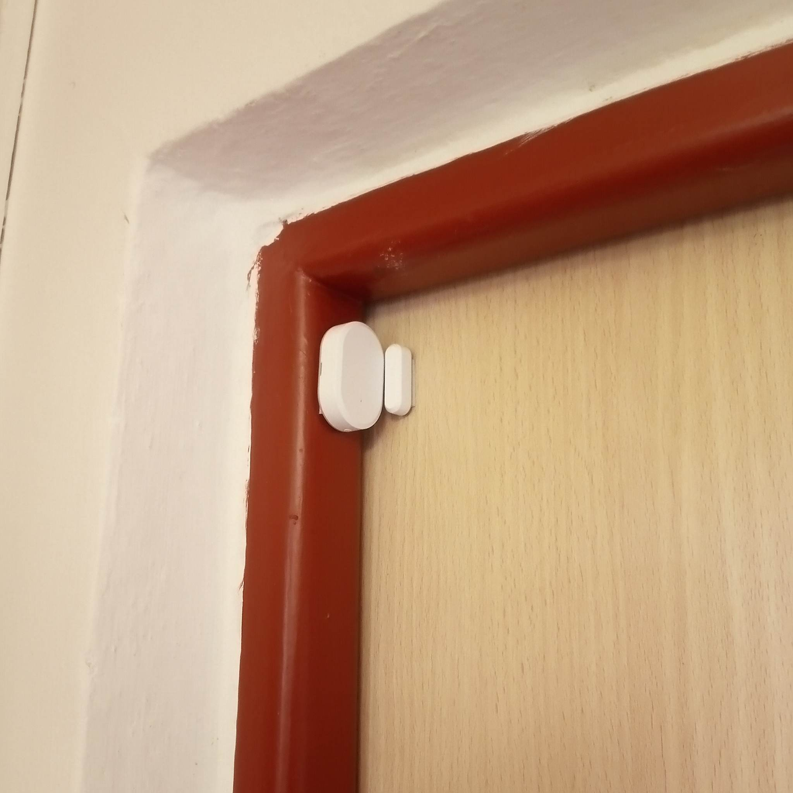
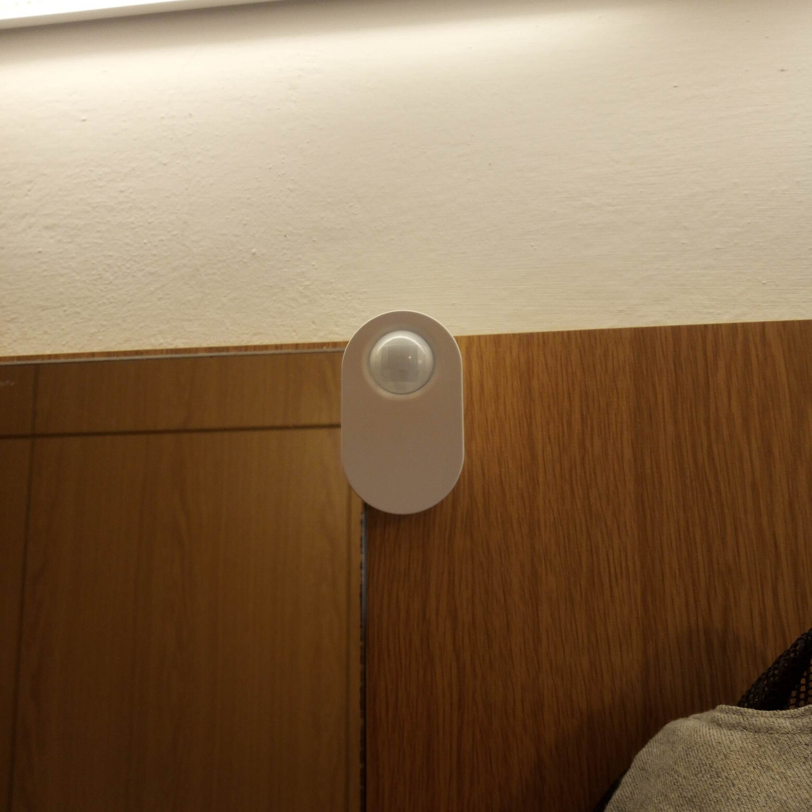
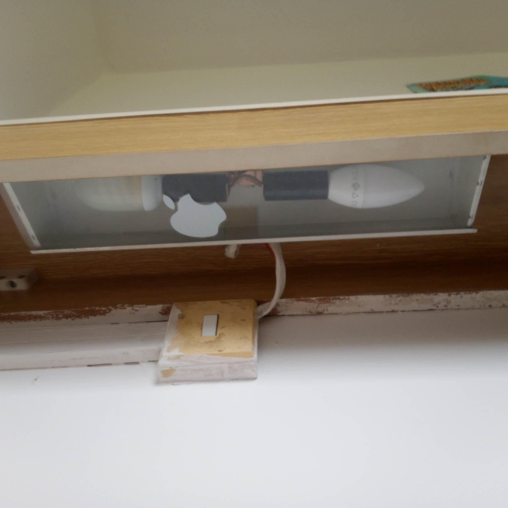
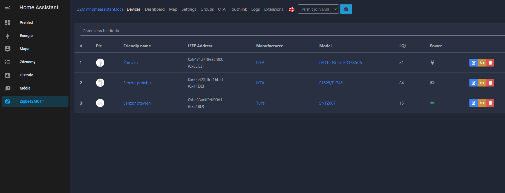
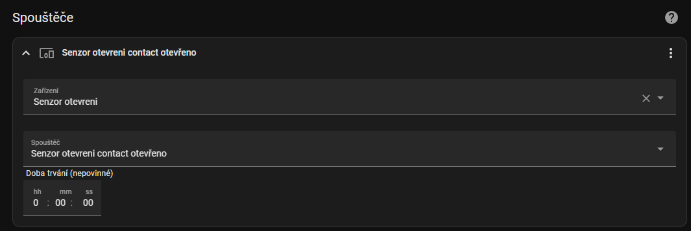
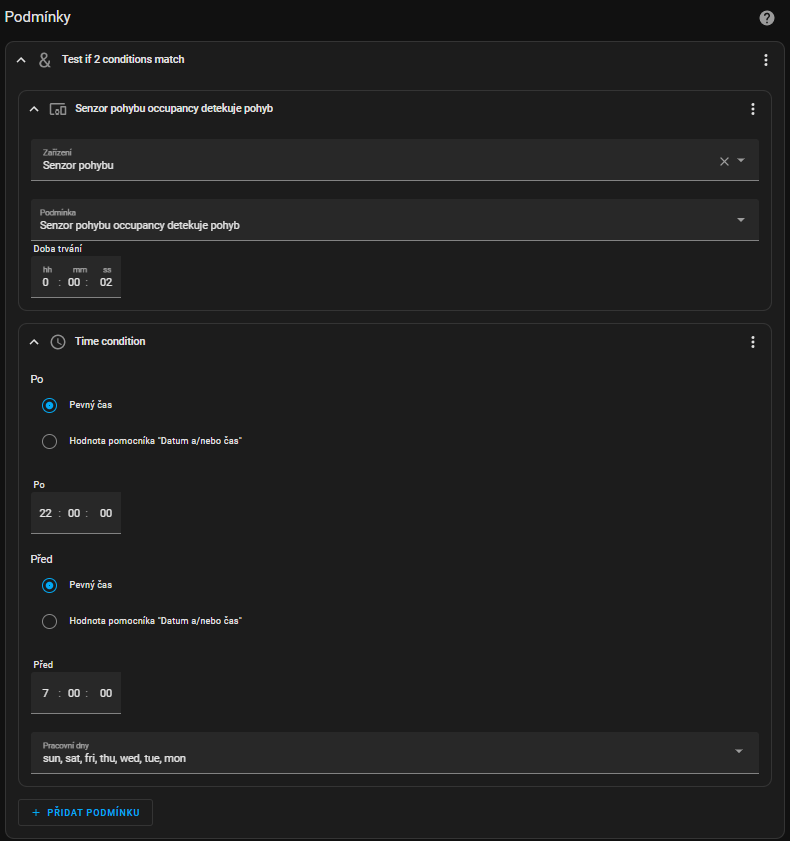
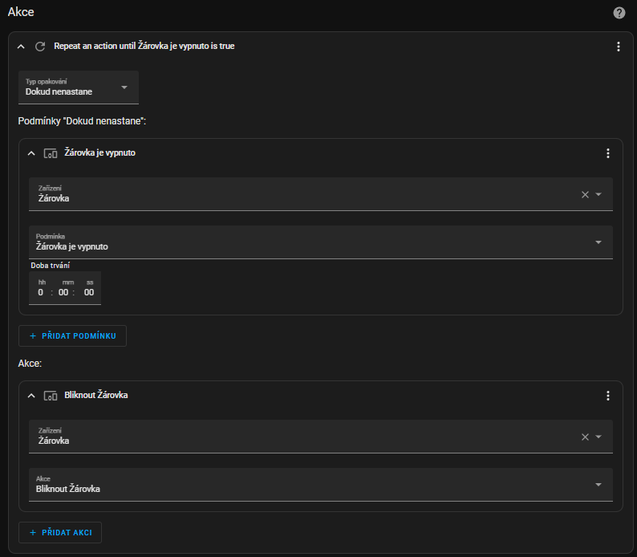
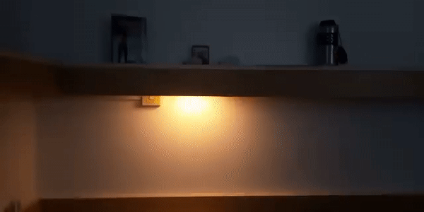
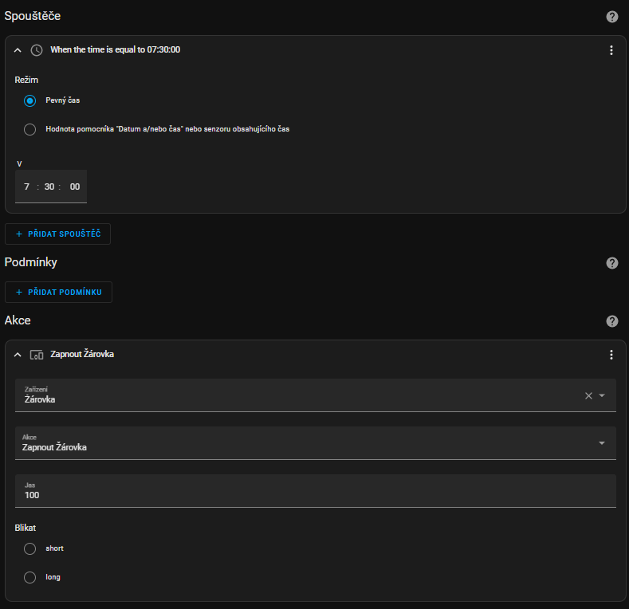

# Semestalni prace k predmetu BTS
## Zadání
volná kreativní úloha pro vytvoření originálního projektu, který bude využívat zařízení IoT a bude řešit libovolný problém v reálném světě.

---

# Tichý alarm
Jedná o vytvoření tichého výstražného systému v případě, že se někdo během spánku začne neoprávněně pohybovat po buňce.


## Použité prostředky
- Raspberry Pi 4 s nainstalovaným Home Assistant
- Zigbee USB dongle
- Zigbee2MQTT 
- senzor pohybu IKEA TRÅDFRI
- senzor otevření dveří ZC-M1
- LED žárovka IKEA TRÅDFRI LED 470 lm E14 5.2W

## Popis funkce
Alarm je spuštěn v případě splnění následujících podmínek:
1. otěvření dveří
2. detekování pohybu
3. časového intervalu mezi detekcí pohybu a otevřením dveří
4. pokud je denní čas mezi 22:00 a 7:00 hodinou

V případě, že všechny podmínky nejsou splněny, tichý alarm není aktivován.

## Popis funkce jednotlivých komponent
### Senzor otevření
Senzor otevření je umístěn v horní části dveří. V případě, že se někdo otevře dveře, senzor odešle signál do Home Assistantu.


### Senzor pohybu
Senzor pohypu je umístěn ve středu chodby, tak aby pokryl celou chodbu. V případě, že se někdo pohybuje v chodbě, senzor odešle signál do Home Assistantu.


### LED žárovka
LED žárovka je umístěna v pokoji nad postelí. V případě, že je tichý alarm aktivován, žárovka bliká.


### Home Assistant
Home Assistant je nainstalován na Raspberry Pi 4. Všechny komponenty jsou připojeny do Home Assistantu pomocí Zigbee koridnátoru.
Pro spuštění alarmu je vytvořen automatizovaný skript, který je spuštěn v případě, že jsou splněny všechny podmínky.

## Konfigurace
Po instalaci HomeAssistanu dle návodu na https://www.home-assistant.io/docs/installation/raspberry-pi/ a core-mosquitto 'core-mosquitto' dle návodu na https://www.home-assistant.io/docs/mqtt/broker/ je potřeba nainstalovat Zigbee2MQTT dle návodu na https://www.zigbee2mqtt.io/getting_started/running_zigbee2mqtt.html. Po instalaci je potřeba přidat do konfiguračního souboru `configuration.yaml` následující konfiguraci:
```
mqtt:
  base_topic: zigbee2mqtt
  server: 'mqtt://localhost'
  user: mqtt_user
  password: mqtt_password
  port: /dev/ttyACM0
```

Pak je přidání zařízení prakticky jednoduché díky Zigbee2MQTT Assistantu, který spouští html konfigurátor. Zde se zařízení po aktivaci párování přidají a je možné s nimi pracovat v Home Assistantu.

GUI Zigbee2MQTT Assistantu vypadá následovně:


## Nastavení automatizace
Pro spuštění alarmu je vytvořen automatizovaný skript, v GUI rozhrání Home Assistantu je možné vytvořit automatizaci pomocí automatizovaného průvodce. V konfiguračním souboru `automations.yaml` je pak možné upravit konfiguraci. V mém případě vypadá konfigurace následovně:

### Spuštěč
Jako spuštěč akce je zvolen senzor otevření, protože pro neoprávněná osoba je to jediný způsob jak se dostat do buňky.



### Podmínky

Podmínky jsou nastaveny tak, aby byl alarm spuštěn pouze v případě, že byly splněny všechny podmínky. Pouhý pohyb na chodbě v denní dobu nebo v noci třeba na záchod není důvod spouštět alarm.


### Akce

Akce je nastavena tak, aby spuštěný alarm běžel dokud není ručně deaktivován. V případě, že je alarm spuštěn, žárovka bliká.



## Ukázka spuštěného alarmu


## Závěr

Vytvořený tichý alarm byl nasazen a testován 2 dny a nebyl shledán žádný problémy s functionalitou. Bonusově byl projekt ještě rozšířen o ranní budík, který rozsvítí žárovku v čase který je nastavený.



Celkově mě projekt velmi bavil a rád bych v budoucnu některé použité prostředky použil pro osobní nasazení v domácnosti.
Kdybych měl více prostředků vytvořil bych ještě pohybem aktivované noční světlo v chodbě, které by se rozsvítilo v případě potřeby a zhaslo po určité době.
Jediné problémy, které bylo nutné překonat byly v případě připojení Raspberry Pi 4 k internetu na kolejích. Zde bylo nutné vytvořit vlastní hotspot a připojit se k němu.


---
Vypracoval: Karel Najman @KNajman