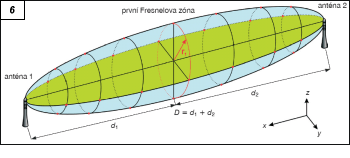
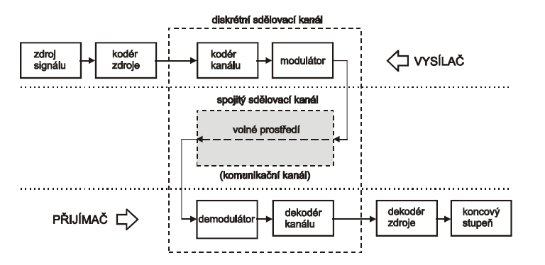

# Vypracované otázky pro předmět BTS (Bezdrátové technologie a sítě) pro rok 2023
@Autor: Karel Najman

## Otázky

### 1. Kmitočtové spektrum a šíření signálu v závislosti na frekvenci

9 kHz - 300 GHz, šíří se prostorem bez nutnosti zvláštního vedení
Kmitočtové spektrum udává, jaké frekvence jsou obsaženy v daném signálu. Šíření signálu závisí na jeho frekvenci - vysokofrekvenční signály mají tendenci se šířit kratší vzdáleností a být více ovlivněny překážkami než nízkofrekvenční signály. To je důvod, proč se například k vysílání rádiových signálů používají nízké frekvence - mají delší dosah a méně jsou ovlivněny překážkami v prostředí.

| Název                            | Zkratka | Frekvenční rozsah | Užití                                                |
| :------------------------------- | :------ | :---------------- |
| Velmi nízké vlny                 | VLF     | 3 kHz - 30 kHz    | Navigace, námořní komunikace                         |
| Dlouhé vlny                      | LF      | 30 kHz - 300 kHz  | Navigace, námořní komunikace                         |
| Střední vlny                     | MF      | 300 kHz - 3 MHz   | AM rozhlas                                           |
| Krátké vlny                      | HF      | 3 MHz - 30 MHz    | Spojení na dlouhé vzdálenosti                        |
| Velmi krátké vlny                | VHF     | 30 MHz - 300 MHz  | FM rozhlas, televize, mobilní sítě                   |
| Ultrakrátké/Decimetrické vlny    | UHF     | 300 MHz - 3 GHz   | Televize, mobilní sítě, letecká a námořní komunikace |
| Superkrátké/Centimetrové vlny    | SHF     | 3 GHz - 30 GHz    | Satelitní komunikace, radar, Wi-Fi                   |
| Extrémně krátké/Milimetrové vlny | EHF     | 30 GHz - 300 GHz  |
| Decimilimetrické vlny            | DMM     | 300 GHz - 3 THz   |

frekvence = rychlost šíření / vlnová délka [Hz]

### 2. Telekomunikační rovnice, informační omezení

Telekomunikační rovnice je rovnice, která popisuje přenos informace v telekomunikačním systému. Zahrnuje různé parametry jako výkon signálu, šířku pásma, úroveň šumu a ztráty signálu na přenosové lince.

Informační omezení je limit, který určuje maximální množství informace, které lze přenést v daném kanálu s omezenou šířkou pásma a úrovní šumu. Shannonova věta popisuje toto omezení a říká, že maximální přenosová rychlost kanálu je omezena šířkou pásma a úrovní šumu. Tuto teorii lze aplikovat na různé telekomunikační systémy, jako jsou například internetové sítě, mobilní sítě nebo satelitní komunikace.

### 3. Fresnelovy zóny, obecné schéma radiokumunikačního systému

Fresnelovy zóny jsou eliptické oblasti, které se vytvářejí kolem přímého viditelného spojení mezi vysílačem a přijímačem v radiokomunikačním systému. Tyto zóny jsou důležité, protože jakýkoliv objekt, který se ocitne v této oblasti, může ovlivnit signál mezi vysílačem a přijímačem.

Obecné schéma radiokomunikačního systému zahrnuje vysílač, přenosovou linku, anténu, prostředí a přijímač. Signál vyslaný z vysílače je přenášen přes přenosovou linku a následně vysílán anténou do prostředí. Poté signál putuje vzduchem (případně jiným prostředím) k přijímači, kde je detekován a dekódován. Signál může být ovlivněn různými faktory, jako jsou ztráty signálu na přenosové lince, šumy, rušení a překážky v prostředí, jako jsou stromy, budovy a další objekty.

### 4. Kódování hovorových signálů

Kódování hovorových signálů se používá v telekomunikačních systémech, jako jsou telefonní sítě, mobilní sítě nebo VoIP služby, k přenosu hlasu mezi dvěma komunikačními body. Existuje několik metod kódování hovorových signálů, které se liší využitím šířky pásma, kvalitou přenosu a nároky na výpočetní výkon.

Jednou z nejpoužívanějších metod kódování je komprese pomocí kodeku, což je algoritmus, který digitalizuje hlasový signál a redukuje jeho velikost pro účely přenosu. Existují různé typy kodeků, které se liší v kvalitě zvuku a požadavcích na šířku pásma. Například kodek G.711 má vysokou kvalitu zvuku, ale vyžaduje vysokou šířku pásma, zatímco kodek G.729 má nižší kvalitu, ale vyžaduje méně šířky pásma.

Další metoda kódování je frekvenční modulace, která se používá v radiokomunikačních systémech, jako jsou vysílače letadel nebo pohotovostních služeb. Tento systém umožňuje přenos hlasu přes velké vzdálenosti a s minimálními nároky na šířku pásma.

### 5. Kanálové kódování

Kanálové kódování se používá v telekomunikačních systémech pro zabezpečení přenosu dat přes rušné a šumy zatížené kanály. Jeho základním principem je přidání redundance k datovému toku, což zvyšuje odolnost proti chybám a umožňuje lépe detekovat a opravovat chyby v přenášených datech.

Existují různé typy kanálového kódování, jako jsou blokové kódy, konvoluční kódy a turbo kódy. Blokové kódy přidávají k datovému bloku další blok, který obsahuje kontrolní informace pro detekci a opravu chyb. Konvoluční kódy přidávají k datovému toku redundanci v podobě zpětnovazebné smyčky, což umožňuje detekovat a opravovat chyby v reálném čase. Turbo kódy jsou nejnovějším typem kanálového kódování, které využívají více kódovacích bloků a optimalizovaných algoritmů pro detekci a opravu chyb.

Kanálové kódování je používáno v mnoha aplikacích, jako jsou digitální televize, mobilní komunikace, satelitní přenosy a mnoho dalších.

### 6. Digitální modulace

Digitální modulace je proces, který umožňuje převod digitálního signálu do analogové formy pro účely přenosu přes analogový kanál, jako je například bezdrátové rádiové spojení. Digitální modulace umožňuje vysílat informace na větší vzdálenosti s menší ztrátou kvality signálu a umožňuje efektivnější využití dostupného pásma.

Existuje několik druhů digitální modulace, jako je například amplitudová modulace (AM), frekvenční modulace (FM), fázová modulace (PM) a kvadraturní amplitudová modulace (QAM). Amplitudová modulace mění amplitudu nosné vlny v závislosti na stavu bitu, frekvenční modulace mění frekvenci nosné vlny a fázová modulace mění fázi nosné vlny. Kvadraturní amplitudová modulace kombinuje amplitudovou modulaci a fázovou modulaci a umožňuje vysílat více bitů za jedno období nosné vlny.

Použití digitální modulace se stává stále důležitějším v moderních telekomunikačních systémech. Digitální modulace se používá v mnoha aplikacích, jako jsou mobilní sítě, satelitní komunikace, bezdrátové sítě, digitální rádio a televize, a další.

### 7. Radiokomunikační systému, buňkový princip, sektorizace, handover

Radiokomunikační systémy jsou navrženy tak, aby umožnily bezdrátovou komunikaci na určité vzdálenosti mezi vysílačem a přijímačem. Buňkový princip je koncept, který umožňuje rozdělit geografickou oblast na menší oblasti, tzv. buňky, aby bylo možné vysílat na kratší vzdálenost a využívat tak efektivněji dostupné pásma. Každá buňka má svůj vlastní vysílač a přijímač, který je schopen komunikovat s mobilními zařízeními, jako jsou mobilní telefony nebo přenosné počítače.

Sektorizace je další koncepční nástroj, který umožňuje rozdělit buňku na menší sektory, které umožňují větší kapacitu a lepší kvalitu signálu. V každém sektoru je umístěn samostatný vysílač a přijímač, který umožňuje komunikaci se zařízeními v daném sektoru.

Handover je proces, který umožňuje přenos komunikace z jedné buňky nebo sektoru na druhou buňku nebo sektor, aby se udržela nejlepší kvalita a spolehlivost signálu. Handover se provádí automaticky nebo manuálně na základě síly signálu a dalších parametrů.

Tyto koncepty jsou základními prvky moderních mobilních sítí a jsou využívány pro zajištění efektivního a spolehlivého bezdrátového spojení pro různé aplikace, jako jsou hlasové a datové služby.

### 8. Sítě 0-2 generace - rozdělení, principy, příklady

Sítě 0-2 generace jsou starší typy mobilních sítí, které se vyvíjely v průběhu 80. a 90. let. Tyto sítě se od moderních sítí, jako jsou 3G a 4G, liší mnoha způsoby.

Sítě 0. generace (1G) byly analogové sítě, které se používaly pro hlasovou komunikaci. Tyto sítě používaly technologii AMPS (Advanced Mobile Phone System), která umožňovala spojení pouze na základě volání. Sítě 1G byly velmi omezené a měly nízkou kapacitu.

Sítě 2. generace (2G) byly digitální sítě, které přinesly mnoho vylepšení oproti sítím 1G. Tyto sítě se dělí na dvě kategorie: TDMA (Time Division Multiple Access) a CDMA (Code Division Multiple Access). TDMA používalo časové dělení pro přenos hovorů, zatímco CDMA používalo kódování pro oddělení jednotlivých hovorů. Sítě 2G umožňovaly vysílat SMS zprávy a měly lepší kapacitu a kvalitu hovorů.

Příkladem sítě 1G je analogová síť AMPS a její evropská verze TACS. Příklady sítí 2G zahrnují GSM (Global System for Mobile Communications), která používá TDMA, a CDMA2000, která používá CDMA.

Sítě 0-2 generace byly velmi omezené, ale zároveň položily základy pro vývoj moderních mobilních sítí. Díky nim jsou dnes možné vysokorychlostní přenosy dat, široká škála aplikací a další funkce, které jsou dnes samozřejmostí.

### 9. Princip fungování GSM, frekvenční skoky, timing advance, identifikace BTS

GSM (Global System for Mobile Communications) je digitální mobilní sítě 2G, která používá technologii TDMA (Time Division Multiple Access) pro přenos hovorů a dat.

Princip fungování GSM spočívá v rozdělení sítě do buněk, kde každá buňka má svůj vlastní BTS (Base Transceiver Station) pro přenos signálu. BTS komunikuje s mobilními telefony pomocí rádiových vln.

GSM využívá frekvenčního skoku (frequency hopping), což je technika, která umožňuje snížit úroveň rušení signálu tím, že se signál přenáší na několika různých frekvencích. To znamená, že signál se neustále přepíná mezi frekvencemi, takže rušení na jedné frekvenci nemá vliv na celý přenos signálu.

Timing advance (časový posun) je další technika používaná v GSM pro zajištění správné synchronizace přenosu signálu mezi mobilním telefonem a BTS. Každá buňka má svůj vlastní časový posun, což umožňuje různým mobilním telefonům v různých buňkách používat stejnou frekvenci bez vzájemného rušení.

Identifikace BTS (Base Transceiver Station) v GSM sítích je důležitá pro správné směrování hovoru nebo datového spojení do správné buňky. Každá BTS má své vlastní identifikační číslo, které se nazývá BTS ID. Při komunikaci se mobilní telefon musí identifikovat s BTS, aby bylo možné zahájit hovor nebo datové spojení a aby bylo možné správně směrovat signál.

### 10. Radiové rozhraní systému GSM, frekvence, zdrojové a kanálové kódování, prokládání

Radiové rozhraní systému GSM se skládá z několika kanálů, které se vysílají na různých frekvencích. V GSM se používají dvě základní frekvence - 900 MHz a 1800 MHz, které jsou rozděleny do 124 kanálů o šířce 200 kHz každý.

Zdrojové kódování se používá pro kompresi hovorových signálů před jejich přenosem po rádiové síti. V GSM se používá ztrátové kódování, které umožňuje dosáhnout vysokého kompresního poměru, ale za cenu určitého zkreslení signálu. Pro zdrojové kódování se v GSM používá algoritmus RPE-LTP (Regular Pulse Excitation - Long Term Prediction).

Kanálové kódování se používá pro ochranu signálu proti chybám, které mohou vzniknout během přenosu po rádiové síti. V GSM se používá konvoluční kódování s kódovou rychlostí 1/2 a délkou konvolučního kódu 3.

Prokládání se používá k rozptýlení chyb v rádiové síti. V GSM se používá systematické blokové prokládání s délkou bloku 456 bitů. Blok je rozdělen na osm řádek po 57 bitech, které jsou vysílány na různých frekvencích a v různých časech, aby se snížila pravděpodobnost vzniku koncentrovaných chyb.

### 11. Radiové rozhraní systému GSM - burst, TDMA rámec, řídící a signalizační kanály, základnové stanice BTS a anténní subsystém

V rádiovém rozhraní systému GSM jsou hovorové signály přenášeny pomocí TDMA (Time Division Multiple Access) metody, která umožňuje vysílat více hovorů současně na jedné frekvenci. TDMA rámec je rozdělen na 8 časových slotů, které jsou přiděleny jednotlivým hovorům. Každý časový slot trvá 577 mikrosekund a obsahuje 156,25 bitů.

Burst je základní jednotka dat v rádiovém rozhraní systému GSM. Burst trvá 4,6 mikrosekund a obsahuje 148 bitů, z nichž 114 bitů je určeno pro přenos uživatelských dat (hlas, data), zatímco zbylých 34 bitů se používá pro řízení a signalizaci.

V GSM jsou k dispozici dva typy kanálů - hovorové kanály a řídící kanály. Řídící kanály slouží k řízení a signalizaci, zatímco hovorové kanály slouží pro přenos hlasových nebo datových informací. Mezi řídící kanály patří například kanály pro přenos signalizačních zpráv pro řízení spojení (CCCH) nebo pro identifikaci mobilní stanice (RACH).

Základnové stanice BTS (Base Transceiver Station) jsou klíčovými prvky rádiové sítě GSM. Každá BTS má vlastní identifikační číslo a sestává z anténního subsystému a radiokomunikačního subsystému. Anténní subsystém zahrnuje antény, které slouží k přenosu a příjmu rádiových signálů, zatímco radiokomunikační subsystém se stará o řízení komunikace mezi BTS a mobilními stanicemi.

### 12. Bezpečnost v síti GSM, služby SMS, CSD, GPRS, EDGE

Bezpečnost v síti GSM je zajištěna pomocí šifrování hovorových a datových spojení. K šifrování se používají algoritmy A5/1 a A5/3. A5/1 byl používán v původní verzi sítě GSM, ale byl později nahrazen vylepšenou verzí A5/3, která je mnohem bezpečnější.

Služby SMS (Short Message Service) umožňují uživatelům posílat krátké textové zprávy mezi mobilními stanicemi. Zprávy jsou omezeny na délku 160 znaků a jsou přenášeny pomocí řídícího kanálu.

CSD (Circuit Switched Data) je služba pro přenos datových informací po telefonním okruhu. Umožňuje uživatelům připojení k internetu nebo k jiným sítím, jako je například ISDN.

GPRS (General Packet Radio Service) je služba pro přenos datových paketů. Umožňuje rychlejší přenos dat než CSD a umožňuje uživatelům stahovat a odesílat e-maily, surfovat po internetu a používat další aplikace.

EDGE (Enhanced Data Rates for GSM Evolution) je vylepšená verze GPRS, která umož

### 13. UMTS - release, frekvence, modulace, struktura sítě
Universal Mobile Telecommunication System
Taky označovaná jako W-CDMA
Využívá W_CDMA (Widebank Code Division Multiple Access) pro přístup k rádiovému rozhraní
Varinty:
 - S-UMTS Satelitní UMTS
 - T-UMTS Terestrická UMTS
   - FDD (Frequency Division Duplex) - párový duplexní přenos pomocí frekvenčního dělení  
   - TDD (Time Division Duplex) - párový duplexní přenos pomocí časového dělení, může být asymetrický (různá rychlost uplinku a downlinku)
Přenosový kanál v základu používá 5 MHz proto wideband.
Od Release 8 je možné použít i 10 MHz kanál.
Od Release 10 až 5 component carrierů, šířky od 1.4 MHz do 20 MHz.
Od Release 11 component carrier ze 2 frekvenčních pásem.
Od GSM se liší takže že sousední buňky používají stejnou frekvenci

### 14. LTE - release, modulace ODFM, SC-FDMA, rozdíly proti UMTS
LTE - long term evolution, Release 8 - 2008 W-CDMA
- dualní přenos, spojení 2 pásem do 10 MHz
- prostorový multiplexing MIMO

ODFM - Orthogonal Division Frequency  Multiplexing
- používá se pro downlink LTE
- používá se pro přenos dat
- mezi odeslanými symboly se vkládají tzv. guard intervaly, které zabraňují interferenci mezi jednotlivými symboly
- s vedlejšími kanály je ortogonální (maximum jednoho se překrývá s minimem druhého)

SC-FDMA - Single Carrier Frequency Division Multiple Access
- používá se pro uplink LTE
- vylepšená verze OFDM, snižuje spotřebu energie, menší rušení
- používá FFT (Fast Fourier Transform) na parelelní přenos dat

### 15. Ostatní sítě 3. a 4. generace

CDMA2000 - 3G, CDMA (Code Division Multiple Access)
- zejména v USA
- pásmá 1.25 MHz, rychlost max 5 Mb/s

TD-SCDMA - 3G, TDMA (Time Division Multiple Access)
- doplněno o synchronizaci terminálů

UWX-136
- prakticty to samé jako EDGE, spíše historický význam

DECT - Digital Enhanced Cordless Telecommunications
- bezdrátová telefonní síť 3. generace

WiMAX - Worldwide Interoperability for Microwave Access

První adept LTE - Advanced 

4G
- založeno na IP komunikaci
- vysokorychlostní přenos dat
- vysoká kapacita a variabilní šířka pásma 5-20 MHz může být i 40 MHz
- vysoká rychlost přenosu dat 100 Mb/s až 1 Gb/s
- celosvětová mobilita

### 16. Sítě 5. a 6. generace, služby NB-IoT

NB-IoT (Narrowband Internet of Things) je technologie pro přenos datových paketů v rádiovém rozhraní sítě LTE Release-13. Je určena pro přenos malých datových objemů a je optimalizována pro přenos dat v oblastech s nízkou rychlostí přenosu dat a s nízkou spotřebou energie.

- nízká cena modulů, malá spotřeba energie, dlouhá životnost baterie
- chyté vše od domácností, spotřebičů, parkovišť, městského osvětlení, až po průmyslové aplikace

5G NR - 5th Generation New Radio
FR1 - 410 - 7125 MHz
FR2 - 24250 - 52600 MHz
3 režimy nasazení:
- NSA (Non-Standalone) - 5G NR a LTE
- SA (Standalone) - 5G NR a 5G Core Network
- Dynamic Spectrum Sharing (DSS) - 5G NR a LTE

6G
- výzkum a vývoj
- vysokorychlostní přenos dat
- chytrá senzorová síť, vysoká spolehlivost, nízká latence
- vyšší frekvenční pásmo až 1 THz
- směrování signálu
- nutné vysoké pokrytí, ale přináší bezbuňkovou strukturu

### 17. GPS - principy a funkce
problematický tvar zeměkoule, nutné použít elipsoid, geoid, kvazi-geoid nebo kouli
souřadné systémy - S-JTSK (souřadnicový systém jednotné trigonometrické sítě katastrální), WGS-84 (World Geodetic System 1984), ETRS-89 (European Terrestrial Reference System 1989)

### 18. GPS - popis jednotlivých systémů

GPS - Global Positioning System
- 24 satelitů, 6 rovin, 4 satelity na rovinu
- 2 frekvence L1 1575.42 MHz a L2 1227.60 MHz
- 2 kódy C/A (Coarse/Acquisition) a P (Precise)

GLONASS - Globalnaja Navigacionnaja Sputnikovaja Sistema
- 24 satelitů, 3 roviny, 8 satelitů na rovinu
- 2 frekvence L1 1602.00 MHz a L2 1246.00 MHz
- 2 kódy C/A (Coarse/Acquisition) a P (Precise)
- 

### 19. Služby RFID, RDS
RFID - Radio Frequency Identification
- identifikace pomocí rádiových vln
- pasivní (bez vlastního zdroje energie) a aktivní (s vlastním zdrojem energie)
- čtečka a tag
- při vysoko frekvenčním RFID je nutné myslet na interferenci s jinými pristředími (kovy, voda, lidské tělo, ...), které mohou rušit signál

| Frekvence     | Název a zkratka            | Dosah | Výkon | Použití                                      |
| ------------- | -------------------------- | ----- | ----- | -------------------------------------------- |
| 125 kHz       | Low Frequency (LF)         | 10 cm | 1 W   | čipy prozvířata, přístupové systémy          |
| 13.56 MHz     | High Frequency (HF)        | 1 m   | 1 W   | docházkové systémy, knihovny, platební karty |
| 860 - 960 MHz | Ultra High Frequency (UHF) | 10 m  | 4 W   | logistika, doprava, průmysl, zdravotnictví   |
| 2.4 - 5.8 GHz a 3.1 - 10 GHz | Microwave Frequency (MW)   | 280 m | 4 W   | doprava, průmysl, zdravotnictví              |

NFC - Near Field Communication
- nástavba na RFID
- definováno mobilními společnostmi
- 13.56 MHz
- umožňuje obousměrnou šifrovanou komunikaci
3 režimy: reader/writer, peer-to-peer, card emulation

RDS - Radio Data System
- přenos dat v rádiovém vysílání, dopklnění k VKV FM

### 20. Služby ADS-B, GMDSS
ADS-B - Automatic Dependent Surveillance - Broadcast
- automatické závislé sledování - vysílání
- vysílání informací o poloze letadla
- 1090 MHz
- vysílání informací o poloze, rychlosti, výšce, letovém plánu, ...
- služby jako flightradar24.com
- 112 bitů - jednou za 10 sekund až 2x za sekundu

Navtex - Navigational Telex
- 518 kHz
- námořní vysílání

GMDSS - Global Maritime Distress and Safety System
- globální námořní bezpečnostní a nouzový systém, náhrada SOS
- Oblasti A1, A2, A3, A4
- 4 typy zpráv: navigační, meteorologické, bezpečnostní, zprávy o nehodách
